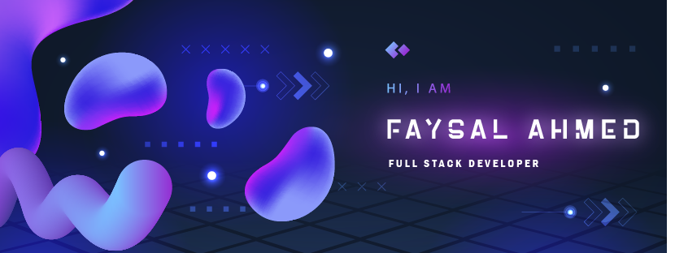

----

I am a passionate programmer and a tech enthusiast. I love to explore new technologies and learn new programming languages. I am currently focusing on web development and learning Computer Engineering fundamentals.I have experience in various programming languages such as C/C++, Java, and JavaScript. I am also familiar with web development frameworks like React and Node.js. I enjoy working on projects that challenge my skills and allow me to learn new things. I am always looking for opportunities to collaborate with other developers and contribute to open-source projects.

I believe that sharing knowledge and working together is the best way to grow as a developer. In my free time, I like to read tech blogs, watch coding tutorials, and participate in coding challenges.

##### I am always open to new ideas and suggestions, so feel free to reach out to me if you want to connect or collaborate on a project

- 👀 I’m interested in Coding
- 🙂
- 🌱

<!---
0xFaysal/0xFaysal is a ✨ special ✨ repository because its `README.md` (this file) appears on your GitHub profile.
You can click the Preview link to take a look at your changes.
--->
<!-- 

&nbsp;
 -->

<h4 align="center">Visitor's count :eyes:</h4>

---

  &nbsp;

----
